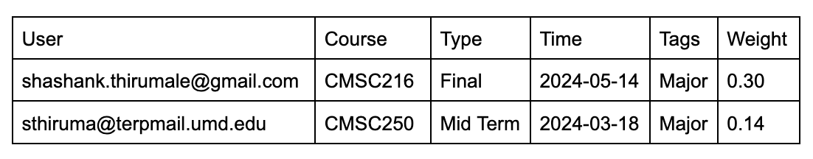

# CollegeCalendar
## Basic Idea 
This is a way for college students to keep track of all of the assignments that they need to do.  
Although there are many services out there that can accompish this goal none of them have the ability to let students get specific information that they might want. 
For example sometimes I want to know all the tests that I have in the next two weeks or I want a list that ranks the importance of assignments so i know which one to start working on.  

## List Options
First users will upload a list of all their assigments and test for every course that they are taking. 
Afterwards the user will be able to get a list of assignments based on what they want.  
They can select  
1. specific class 
2. specific types of assignments 
3. specific time range 
4. a combination or some or all of the options.  

Users can also sort the list by 

1. due date 
2. course 
3. importance 
4. a combination of the some or all of the options.  

## Functionality
1. Users will have to login using a username to be able to access their courses and assignments. 
2. Users will also have the ability to turn on notifications* and daily reports**. 
3. When users log into the website they will first be greeted with a calendar that shows all the assignments that are due for the current week. 
4. Once the users scroll down they will be met with a place where they can select what type of list they want to generate. 
5. When users continue to scroll they will be met with a place to add courses, assignments, and types of assignments. 
*The daily reports will give information about all of the assignments that are due in the next seven days and will show any exams that are less than two weeks away. 
**The notifications will be reminders to finish specific assignmenets that are really important like projects or to study for a exam.  

### Possible Functionality:
Inorder to create a way to rank the importance of an assigment there are two major factors: The weight of the assignment and the number of days until the assignment is due. 
The issue is that it will be hard to determine how important the weight of the assignment in comparison to the the due date.  
For example a homework assignment(1% of the final grade) due one week from now is not as important as a final(30% of the final grade) that is two weeks away. 
There must be a way to statistically create an algorithm that can help dertermine which assigments are more important. 
I think that having a survey in the website to see what assignments people prioritize in a specific situarion could help. 
So asking questions like "Would you prioritize studying for a test that is 3 weeks away or doing a homework assigments that is due in 5 days" could help me collect data to create an AI based algorithm.  

## High Level Flow Chart
 

## Technology
**Database:** SQL - MySQL 
**API** to connect database to backend technology 
**Backend:** Node.js 
**FrontEnd:** React.js 
**Web Development:** HTML, CSS, and JavaScript 

## Database
 

